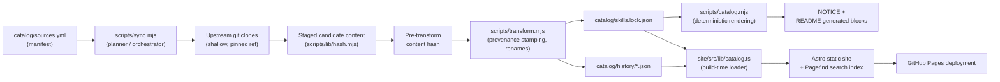

# Architecture

[繁體中文](../zh-TW/architecture.md) | [**English**](../en/architecture.md) | [Documentation home](README.md)

This page is a cross-file reference for how the registry's pieces fit
together. Each stage links to the page that documents it in depth.

## Data flow

1. **`catalog/sources.yml`** declares every upstream, mapping, orphan, local
   root, override, and link exception (see [Configuration](configuration.md)).
2. **`scripts/sync.mjs`** reads the manifest and either plans or delegates a
   real apply/baseline to **`scripts/lib/baseline.mjs`**, which owns the apply
   lock, journal, candidate/backup swap, and recovery (see
   [Sync and releases](sync-and-releases.md)).
3. Declared upstreams are **shallow-cloned** at their pinned branch/tag —
   never at a bare commit SHA — and mapped sources are staged into a
   temporary workspace using the same exclusion and symlink policy on every
   code path.
4. **`scripts/transform.mjs`** stamps upstream provenance (and applies any
   `rename-frontmatter-name` override) onto the staged `SKILL.md`, always
   *after* the content has already been hashed, so the recorded
   `contentHash` reflects the real upstream content, not the local stamp.
5. The result is written to **`catalog/skills.lock.json`** (current state per
   skill) and **`catalog/history/*.json`** (one ledger per skill, every
   version bump ever recorded).
6. **`scripts/catalog.mjs`** deterministically renders the lock file into
   **`NOTICE`** and the
   `<!-- CATALOG:START -->`/`<!-- INSTALL:START -->` blocks in the root
   `README.md` — never edited by hand (see
   [Skill management](skill-management.md#why-generated-outputs-cannot-be-edited-independently)).
7. At build time, **`site/src/lib/catalog.ts`** reads the lock file for every
   catalog route and reads a skill's history ledger for that skill's detail
   timeline (see [Website](website.md)).
8. The built site (including its Pagefind search index) deploys to **GitHub
   Pages**.

`node scripts/validate.mjs` cuts across every stage: it walks the whole
`skills/` tree independently of any one sync run, checking frontmatter,
manifest coverage, and relative links. Both apply engines run it after the
candidate swap and roll back on failure. The workflow also runs a separate
pre-apply validation (and an explicit post-apply validation for baseline).

## Safety boundaries

- **Protected roots.** `skills/lettucebo` can never be written by sync,
  regardless of what the manifest declares — this is enforced independently
  of the `local:` section, so a manifest edit alone cannot lift the
  protection.
- **Path-traversal and collision guards.** Manifest paths are rejected if
  they decode to a `..` segment, and two mappings can never resolve to the
  same or a nested destination — both checks run before any clone or write.
- **Deletion guard.** A group with fewer than 10 declared mappings blocks any
  removal; larger groups block removal above 30%. An unavailable upstream is
  also a hard block and is never interpreted as deletion (see
  [Skill management](skill-management.md#deletion-guard)).
- **Transaction, rollback, and crash recovery.** Every real write goes
  through an apply lock, a candidate/backup swap, and a durable journal, so a
  failed post-apply validation is rolled back immediately. A crash mid-swap
  is resolved from the journal on the next apply after a stale lock is
  safely cleared, or leaves a clearly reported, manually recoverable backup
  (see [Sync and releases](sync-and-releases.md#transaction-safety-journal-rollback-crash-recovery)).

## Restricted content isolation

Every skill marked `"redistributable": false` is isolated in the **website
data layer**: `loadSkillBody` refuses to read its `SKILL.md` body. Its detail
page still shows catalog metadata (name, version, status, license, available
upstream provenance, and history), but no description, instructions, or
single-skill install command. Source-level commands are also suppressed when
that source contains restricted content.

The full-registry command is the deliberate exception: the catalog renders it
with a warning that selecting the full inventory includes restricted skills.
The vendored bytes also remain present in tagged repository trees, so this
boundary is website rendering and command suppression, not removal from Git.
The current restricted set is visible on `/status/` or by searching the
lockfile for `"redistributable": false`; it is never enumerated here.

## See also

- [Configuration](configuration.md), [Skill management](skill-management.md),
  [Sync and releases](sync-and-releases.md), and [Website](website.md) — the
  detailed pages this overview links into.
