# Architecture

[繁體中文](../zh-TW/architecture.md) | [**English**](../en/architecture.md) | [Documentation home](README.md)

This page is a cross-file reference for how the registry's pieces fit
together. Each stage links to the page that documents it in depth.

## Data flow

```mermaid
flowchart LR
    A["catalog/sources.yml<br/>(manifest)"] --> B["scripts/sync.mjs<br/>(planner / orchestrator)"]
    B --> C["Upstream git clones<br/>(shallow, pinned ref)"]
    C --> D["Staged candidate content<br/>(scripts/lib/hash.mjs)"]
    D --> F["Pre-transform<br/>content hash"]
    F --> E["scripts/transform.mjs<br/>(provenance stamping, renames)"]
    E --> G["catalog/skills.lock.json"]
    E --> H["catalog/history/*.json"]
    C --> W["Pinned license evidence<br/>+ catalog/licenses/"]
    W --> G
    G --> M["scripts/catalog.mjs<br/>(deterministic rendering)"]
    M --> I["NOTICE + license bundle +<br/>README generated blocks"]
    G --> N["scripts/lib/enrichment.mjs<br/>(schema, eligibility, freshness)"]
    H --> N
    N --> Q["scripts/enrich-summaries.mjs<br/>(Copilot + OpenCC)"]
    G --> R["scripts/enrich-changelog.mjs<br/>(full clones, pinned traversal)"]
    N --> R
    Q --> O["catalog/enrichment/<br/>summaries + changelog"]
    R --> S["Copilot CLI<br/>(one bilingual call per skill)"]
    S --> O
    G --> J["site/src/lib/catalog.ts<br/>(build-time loader)"]
    H --> J
    O --> P["site/src/lib/enrichment.ts<br/>(freshness-gated loader)"]
    T["site/src/i18n/<br/>(typed locales, dictionaries, paths)"] --> K
    P --> K
    J --> K["Shared Astro page components<br/>+ explicit locale routes"]
    K --> U["Localized static pages<br/>+ legacy redirect pages"]
    U --> V["Pagefind per-language indexes"]
    V --> L["GitHub Pages deployment"]
```



1. **`catalog/sources.yml`** declares every upstream, mapping, orphan, local
   root, override, and link exception (see [Configuration](configuration.md)).
2. **`scripts/sync.mjs`** reads the manifest and either plans or delegates a
   real apply/baseline/deproprietize/license-refresh operation to
   **`scripts/lib/baseline.mjs`**, which owns the apply lock, journal,
   candidate/backup swap, and recovery (see
   [Sync and releases](sync-and-releases.md)).
3. Declared upstreams are **shallow-cloned** at their pinned branch/tag —
   never at a bare commit SHA — and mapped sources are staged into a
   temporary workspace using the same exclusion and symlink policy on every
   code path.
4. **`scripts/transform.mjs`** stamps upstream provenance (and applies any
   `rename-frontmatter-name` override) onto the staged `SKILL.md`, always
   *after* the content has already been hashed, so the recorded
   `contentHash` reflects the real upstream content, not the local stamp.
5. The result is written to **`catalog/skills.lock.json`** (current state per
   skill) and **`catalog/history/*.json`** (one ledger per skill, every
   version bump and license metadata refresh ever recorded). Every lock entry
   has structured `licenseEvidence`.
6. Explicit `--refresh-licenses` fetches enough declared-ref history to prove
   each lock-pinned commit is reachable, checks out that exact commit, and
   resolves restricted policy, skill-local files, frontmatter, upstream-root
   files, then unresolved. Root texts actually used are stored byte-for-byte
   under **`catalog/licenses/`** with deterministic evidence metadata.
7. **`scripts/catalog.mjs`** deterministically renders the lock file into
   **`NOTICE`** and the
   `<!-- CATALOG:START -->`/`<!-- INSTALL:START -->` blocks in the root
   `README.md` — never edited by hand (see
   [Skill management](skill-management.md#why-generated-outputs-cannot-be-edited-independently)).
8. **`scripts/lib/enrichment.mjs`** defines the shared sidecar schema,
   eligibility rules, freshness keys, and locale signatures.
   **`scripts/enrich-summaries.mjs`** makes one Copilot request per eligible
   skill for English and Traditional Chinese, derives Simplified Chinese with
   OpenCC, and writes each artifact atomically. The first complete summary set
   is validated before the generator enables summaries in
   `catalog/enrichment/manifest.json`.
9. **`scripts/enrich-changelog.mjs`** filters eligible skills from the lock
   before any per-skill data access, skips fully cached upstream groups, and
   full-clones each remaining distinct upstream once. It traverses each
   `SKILL.md` through the exact pinned commit with NUL-delimited, no-merge,
   rename-aware Git history. Copy history is crossed only when a later source
   deletion proves a migration; otherwise the artifact records truncation.
   Every commit patch is restricted to the tracked path (or explicit
   transition pair) before one bilingual Copilot request is made per skill.
10. At build time, **`site/src/lib/catalog.ts`** reads the lock file for every
   catalog route and reads a skill's registry-release history ledger for its
   History timeline (see [Website](website.md)).
11. **`site/src/lib/enrichment.ts`** reads only the requested locale from a
   fresh, schema-valid sidecar. Restricted or tombstoned skills are rejected
   before a sidecar path is touched; orphan skills are also rejected for
   changelogs. Its centralized changelog view model derives the latest
   included author date from `commits[0].date` only after the complete
   provenance freshness check. A missing artifact, stale artifact, or
   missing requested summary locale returns the caller's existing fallback.
   Changelog rendering may retain validated commit metadata and the original
   untranslated subject while omitting a missing or invalid localized
   generated summary; it never substitutes the English generated summary.
   The mandatory manifest and any artifact that exists must parse; unexpected
   I/O or unrelated schema failures stop the build.
12. Detail metadata, catalog cards, and source tables render that pinned
    latest-included date. Skill pages place the changelog timeline in a
    closed, Pagefind-excluded native disclosure above the raw body, while the
    registry History ledger remains separate at the page foot; upstream
    commits are never conflated with registry releases.
13. **`site/src/i18n/`** centralizes the supported locale type, dictionaries,
    parser/assertion, HTML language mapping, and base-aware path helpers.
    Shared page components render the five logical page kinds, while explicit
    `[locale]` routes expand them for `en`, `zh-tw`, and `zh-cn`.
14. The current catalog produces 390 localized pages plus 130 unprefixed
    static redirect pages. Redirects preserve the old logical target, use
    English as the canonical/meta/no-JS fallback, and are excluded from
    Pagefind. Only the 115 skill pages per locale opt into Pagefind, producing
    345 indexed pages across three language indexes. Together these routes
    produce exactly 520 HTML pages.
15. The built site deploys to **GitHub Pages**.

`node scripts/validate.mjs` cuts across every stage: it walks the whole
`skills/` tree independently of any one sync run, checking frontmatter,
manifest coverage, relative links, and the post-2.0 permanent restricted
denylist, while also validating lock license evidence and the bundled root
license files. All four transactional modes (`--apply`, `--baseline`,
`--deproprietize`, and `--refresh-licenses`) use it; deproprietize
also validates the complete candidate before the first swap. The workflow
also runs a separate pre-apply validation.

Enrichment validation is deliberately outside that transaction. The default
`npm run validate:enrichment` command always enforces sidecar safety:
every artifact in an existing kind directory must be schema-valid and
path-safe, and artifacts cannot refer to skills that are restricted,
tombstoned, or absent from the lock. An enabled kind must also have its
directory. Missing and stale artifacts pass. Publishing uses
`npm run validate:enrichment -- --strict`,
which additionally requires the artifact set to exactly match the eligible
skills, every artifact to be fresh, and changelog locale signatures to match
the current prompt/model/converter/generator contract. Both generators apply
the same completeness gate before first enablement. Routine registry sync and
site fallback behavior remain decoupled, so a legitimate upstream swap is not
rolled back merely because optional sidecars have not caught up.

## Enrichment sidecar contract

Both artifact kinds use the history filename convention. For example,
`skills/azure/az-cost-optimize` maps to
`skills__azure__az-cost-optimize.json` below its kind directory. The shared
shape is frozen at schema version 1:

```json
{
  "path": "skills/azure/az-cost-optimize",
  "schemaVersion": 1,
  "freshnessKey": {
    "contentHash": "sha256:...",
    "repository": "github/awesome-copilot",
    "reference": "refs/heads/main",
    "source": "skills/az-cost-optimize",
    "pinnedCommit": "..."
  },
  "locales": {
    "en": {
      "signature": "sha256:...",
      "producer": "llm",
      "model": "gpt-5.4",
      "promptHash": "sha256:...",
      "generatorVersion": 1,
      "content": {}
    },
    "zh-tw": {
      "signature": "sha256:...",
      "producer": "llm",
      "model": "gpt-5.4",
      "promptHash": "sha256:...",
      "generatorVersion": 1,
      "content": {}
    },
    "zh-cn": {
      "signature": "sha256:...",
      "producer": "opencc",
      "converterVersion": "1.0.6",
      "generatorVersion": 1,
      "content": {}
    }
  }
}
```

Summary freshness contains only `contentHash`. Changelog freshness contains
the full provenance tuple shown above, so a new pinned commit invalidates a
changelog even when the upstream bytes are unchanged. Mapped skills use their
pre-transform `contentHash`; orphan and local summary artifacts use
`snapshotHash` as the value of the `contentHash` field.

Summary eligibility is `not tombstone AND not restricted`. Changelog
eligibility adds `upstream != null`, so frozen orphans cannot accidentally
receive changelogs. Each locale signature hashes the locale, schema version,
producer, prompt ID, prompt hash, model or converter version, mandatory
generator version, and the pinned Copilot CLI contract. The generator version
is the explicit cache invalidation control for logic-only changes.

Changelog locale content contains a deterministic newest-first `commits`
array sorted by Git `%aI` author date. Each entry records the upstream SHA,
author date, untranslated subject,
exact commit URL, `pathAtCommit`, resolution method, localized summary, and an
auditable rename/copy transition when applicable. A still-live copy source
adds `truncatedAt` instead of inheriting unrelated source history.

The website labels `commits[0].date` as **Latest included change**, because it
describes the newest author date present at the pinned registry revision.
Rebase or cherry-pick operations can retain an older author date, so this
field is deliberately not presented as a live upstream “last updated” time.

`scripts/lib/localization.mjs` is the single deterministic Chinese conversion
boundary. It uses `opencc-js` with the Taiwan-phrases-to-Simplified
`twp -> cn` preset and records `opencc-js:twp-to-cn@<version>` in both the
`zh-cn` locale artifact and its signature. When either enrichment kind is
enabled, generators must materialize all three locale slots (`en`, `zh-tw`,
and `zh-cn`), matching the site's three public locale routes. No custom
glossary is embedded here; later editorial vocabulary work remains tracked by
[issue #12](https://github.com/lettucebo/Skills/issues/12).

## Safety boundaries

- **Protected roots.** `skills/lettucebo` can never be written by sync,
  regardless of what the manifest declares — this is enforced independently
  of the `local:` section, so a manifest edit alone cannot lift the
  protection.
- **Path-traversal and collision guards.** Manifest paths are rejected if
  they decode to a `..` segment, and two mappings can never resolve to the
  same or a nested destination — both checks run before any clone or write.
- **Deletion guard.** A group with fewer than 10 declared mappings blocks any
  removal; larger groups block removal above 30%. An unavailable upstream is
  also a hard block and is never interpreted as deletion (see
  [Skill management](skill-management.md#deletion-guard)).
- **Transaction, rollback, and crash recovery.** Every real write goes
  through an apply lock, a candidate/backup swap, and a durable journal, so a
  failed post-apply validation is rolled back immediately. A crash mid-swap
  is resolved from the journal on the next apply after a stale lock is
  safely cleared, or leaves a clearly reported, manually recoverable backup
  (see [Sync and releases](sync-and-releases.md#transaction-safety-journal-rollback-crash-recovery)).
- **Forbidden-sidecar pruning.** After an applied upstream update and before
  its commit, `npm run enrich:prune` removes artifacts whose skill became
  restricted, became a tombstone, or left the lock. It performs deletion only
  and has no LLM, network, or API-key dependency.

## Restricted content isolation

The four proprietary anthropics mirrors were removed before the first release
tag. Their lock entries are `removed` tombstones and their ledgers retain a
`mapping-removed` entry, but their mappings, directories, routes, redirects,
and enrichment artifacts are absent. The active catalog therefore has zero
restricted skills.

`RESTRICTED_SKILL_PATHS` permanently keeps those four paths as a denylist.
For release 2.0.0 and later, validation rejects a denylisted path on disk, in
an active mapping, or in an active lock entry. The license resolver's
restricted branch and all site fail-closed paths remain in place for fixtures
and any future active restricted inventory: `loadSkillBody` still refuses to
read restricted content, and restricted source/single-skill commands remain
suppressed.

## See also

- [Configuration](configuration.md), [Skill management](skill-management.md),
  [Sync and releases](sync-and-releases.md), and [Website](website.md) — the
  detailed pages this overview links into.
