# 系統架構

[**繁體中文**](../zh-TW/architecture.md) | [English](../en/architecture.md) | [文件首頁](README.md)

本頁是一份跨檔案的參考，說明這個 registry 的各個元件如何組合在一起。每個階段
都連結到深入說明它的頁面。

## 資料流

```mermaid
flowchart LR
    A["catalog/sources.yml<br/>（manifest）"] --> B["scripts/sync.mjs<br/>（規劃／協調）"]
    B --> C["上游 git clone<br/>（shallow，釘選 ref）"]
    C --> D["Staged candidate 內容<br/>（scripts/lib/hash.mjs）"]
    D --> F["轉換前<br/>內容雜湊"]
    F --> E["scripts/transform.mjs<br/>（來源證明蓋章、改名）"]
    E --> G["catalog/skills.lock.json"]
    E --> H["catalog/history/*.json"]
    C --> W["釘選授權證據<br/>+ catalog/licenses/"]
    W --> G
    G --> M["scripts/catalog.mjs<br/>（確定性渲染）"]
    M --> I["NOTICE + 授權原文包 +<br/>README 產生區塊"]
    G --> N["scripts/lib/enrichment.mjs<br/>（schema、資格、freshness）"]
    H --> N
    N --> Q["scripts/enrich-summaries.mjs<br/>（Copilot + OpenCC）"]
    G --> R["scripts/enrich-changelog.mjs<br/>（full clone、釘選 history）"]
    N --> R
    Q --> O["catalog/enrichment/<br/>summaries + changelog"]
    R --> S["Copilot CLI<br/>（每個 skill 一次雙語呼叫）"]
    S --> O
    G --> J["site/src/lib/catalog.ts<br/>（建置時期載入器）"]
    H --> J
    O --> P["site/src/lib/enrichment.ts<br/>（freshness gate 載入器）"]
    T["site/src/i18n/<br/>（型別化 locale、字典、路徑）"] --> K
    P --> K
    J --> K["共用 Astro 頁面元件<br/>+ 明確 locale 路由"]
    K --> U["在地化靜態頁面<br/>+ 舊版 redirect 頁面"]
    U --> V["Pagefind 各語言索引"]
    V --> L["GitHub Pages 部署"]
```



1. **`catalog/sources.yml`** 宣告每個上游、mapping、orphan、local root、
   override 與連結例外（見 [環境設定](configuration.md)）。
2. **`scripts/sync.mjs`** 讀取 manifest，並依模式進行規劃，或把真正的
   apply／baseline／deproprietize／license-refresh 委派給 **`scripts/lib/baseline.mjs`**；後者
   負責 apply lock、journal、candidate／backup swap 與復原（見
   [同步與發布](sync-and-releases.md)）。
3. 宣告的上游會在其釘選的 branch／tag 上進行 **shallow clone** — 絕不使用純
   commit SHA — 而 mapped 來源會在每一條程式路徑上都以相同的排除與符號連結
   規則，staging 到暫存工作區。
4. **`scripts/transform.mjs`** 會把上游來源證明（以及任何
   `rename-frontmatter-name` override）蓋章到 staged 的 `SKILL.md` 上，且永遠
   在內容已經雜湊**之後**才進行，因此記錄下來的 `contentHash` 反映的是真正的
   上游內容，而不是本機蓋章之後的內容。
5. 結果會寫入 **`catalog/skills.lock.json`**（每個 skill 的目前狀態）與
   **`catalog/history/*.json`**（每個 skill 一份帳本，記錄它曾經發生過的每一
   次版本調整與授權 metadata refresh）。每個 lock 項目都有結構化
   `licenseEvidence`。
6. 明確的 `--refresh-licenses` 會抓取足以證明各 lock 釘選 commit 可由宣告 ref
   追溯的 history，checkout 該精確 commit，依 restricted policy、skill-local
   檔案、frontmatter、上游根目錄檔案、unresolved 的順序解析。實際採用的根授權
   原文會逐位元組存入 **`catalog/licenses/`**，並附確定性證據 metadata。
7. **`scripts/catalog.mjs`** 會依 lockfile 確定性地渲染 **`NOTICE`**，以及根目錄
   `README.md` 中的
   `<!-- CATALOG:START -->`／`<!-- INSTALL:START -->` 區塊 — 絕不手動編輯
   （見 [技能管理](skill-management.md#為什麼產生的輸出不能被獨立編輯)）。
8. **`scripts/lib/enrichment.mjs`** 定義共用 sidecar schema、資格規則、
   freshness key 與 locale signature。**`scripts/enrich-summaries.mjs`** 會為
   每個符合資格的 skill 呼叫一次 Copilot，以產生英文與繁體中文，再以 OpenCC
   衍生簡體中文，並以 atomic write 寫入每個 artifact。第一組完整摘要會先通過
   驗證，generator 才會在 `catalog/enrichment/manifest.json` 啟用 summary。
9. **`scripts/enrich-changelog.mjs`** 會先從 lock 過濾符合資格的 skill，才接觸
   個別 skill 資料；完整 cache hit 的上游群組會直接跳過，其餘每個不同上游只做
   一次 full clone。它以 NUL-delimited、排除 merge、支援 rename inference 的 Git
   history，走到各 `SKILL.md` 的精確釘選 commit。只有在來源檔後續確實刪除、可
   證明為 migration 時才跨越 copy history；否則 artifact 會記錄 truncation。
   每個 commit patch 在每個 skill 一次的雙語 Copilot 呼叫前，都只允許 tracked
   path 或明確 transition pair。
10. 在建置時期，**`site/src/lib/catalog.ts`** 會為所有 catalog route 讀取
   lockfile，並在個別 skill 詳情頁讀取該 skill 的 registry release History
   timeline（見 [網站](website.md)）。
11. **`site/src/lib/enrichment.ts`** 只會從新鮮且符合 schema 的 sidecar 讀取指定
   locale。受限制或 tombstone skill 會在碰觸 sidecar 路徑前被拒絕；orphan skill
   也會在 changelog 讀取前被拒絕。集中式 changelog view model 只有在完整來源
   證明 freshness 檢查通過後，才會從 `commits[0].date` 衍生最新收錄的 author
   date。Artifact
   缺少、過期或指定 summary locale 缺少時，會回傳呼叫端既有的 fallback。
   Changelog 可在驗證安全後保留 commit metadata 與刻意不翻譯的原始 subject，
   同時省略缺少或無效的在地化生成摘要；絕不以英文生成摘要替代。必要的 manifest
   與任何實際存在的 artifact 都必須能解析，非預期 I/O 或無關的 schema 失敗會
   停止建置。
12. 詳情 metadata、目錄卡片與來源表格會渲染這個釘選的最新收錄日期。Skill
    詳情頁把 changelog timeline 放在原始內容上方、預設收合且排除於 Pagefind 的
    原生 disclosure 中；registry History 帳本則維持頁尾獨立區塊，上游 commit
    絕不與 registry release 混合。
13. **`site/src/i18n/`** 集中管理支援的 locale 型別、字典、parser/assertion、
    HTML 語言對應與理解 base path 的路徑 helper。共用頁面元件渲染五種邏輯頁面，
    明確的 `[locale]` 路由則為 `en`、`zh-tw` 與 `zh-cn` 展開它們。
14. 目前 catalog 產生 390 個在地化頁面與 130 個無語言前綴的靜態 redirect
    頁面。Redirect 保留舊版邏輯目標，以英文作為 canonical、meta 與 no-JS
    fallback，並排除於 Pagefind 之外。每個 locale 只有 115 個 skill 頁加入
    Pagefind，因此三個語言索引合計 345 個已索引頁面；全部路由合計正好產生
    520 個 HTML 頁面。
15. 建置完成的網站會部署到 **GitHub Pages**。

`node scripts/validate.mjs` 橫跨每一個階段：它會獨立於任何一次同步執行，走遍
整個 `skills/` 樹，檢查 frontmatter、manifest 涵蓋範圍、相對連結與 2.0 之後的
永久 restricted denylist，並驗證 lock 授權證據與根授權原文包。四個交易模式
（`--apply`、`--baseline`、
`--deproprietize`、`--refresh-licenses`）都會使用它；
deproprietize 還會在第一次 swap 前驗證完整 candidate。Workflow 另外執行一次
套用前驗證。

Enrichment 驗證刻意位於這項交易之外。預設的
`npm run validate:enrichment` 永遠強制 sidecar 安全性：現有種類目錄中的每個
artifact 都必須符合 schema 且路徑安全，也不得指向 restricted、tombstone 或已
離開 lock 的 skill。已啟用種類還必須存在目錄；缺少與過期 artifact 都會通過。
發布時使用
`npm run validate:enrichment -- --strict`，再額外要求 artifact 集合與符合資格的
skill 完全相等、每個 artifact 都是最新狀態，且 changelog locale signature 符合
目前的 prompt／model／converter／generator 契約。兩個 generator 都會在第一次
啟用前套用相同的完整性 gate。日常 registry sync 與網站 fallback 行為仍彼此
解耦，因此合法的上游 swap 不會只因為選用 sidecar 尚未追上就被回溯。

## Enrichment sidecar 契約

兩種 artifact 都沿用 history 檔名慣例。例如
`skills/azure/az-cost-optimize` 在對應種類目錄中會成為
`skills__azure__az-cost-optimize.json`。共用結構凍結在 schema version 1：

```json
{
  "path": "skills/azure/az-cost-optimize",
  "schemaVersion": 1,
  "freshnessKey": {
    "contentHash": "sha256:...",
    "repository": "github/awesome-copilot",
    "reference": "refs/heads/main",
    "source": "skills/az-cost-optimize",
    "pinnedCommit": "..."
  },
  "locales": {
    "en": {
      "signature": "sha256:...",
      "producer": "llm",
      "model": "gpt-5.4",
      "promptHash": "sha256:...",
      "generatorVersion": 1,
      "content": {}
    },
    "zh-tw": {
      "signature": "sha256:...",
      "producer": "llm",
      "model": "gpt-5.4",
      "promptHash": "sha256:...",
      "generatorVersion": 1,
      "content": {}
    },
    "zh-cn": {
      "signature": "sha256:...",
      "producer": "opencc",
      "converterVersion": "1.0.6",
      "generatorVersion": 1,
      "content": {}
    }
  }
}
```

Summary freshness 只含 `contentHash`。Changelog freshness 則包含上方完整的來源證明
tuple，因此即使內容位元組未改變，只要釘選 commit 更新，就會讓 changelog 失效。
Mapped skill 使用轉換前的 `contentHash`；orphan 與 local 的 summary artifact 則把
`snapshotHash` 放在 `contentHash` 欄位中。

Summary 的資格是「非 tombstone 且非 restricted」。Changelog 另外要求
`upstream != null`，因此 frozen orphan 不可能誤產生 changelog。每個 locale
signature 會雜湊 locale、schema version、producer、prompt ID、prompt hash、model
或 converter version、必要的 generator version，以及釘選的 Copilot CLI contract。
Generator version 是 generator 邏輯改變但 prompt 未變時，明確使 cache 失效的控制。

Changelog locale content 包含確定性、依 Git `%aI` author date 由新到舊排序的
`commits` 陣列。每一筆記錄上游 SHA、author date、刻意不翻譯的 subject、精確
commit URL、`pathAtCommit`、
解析方式、在地化摘要，以及適用時可稽核的 rename/copy transition。若 copy 來源
仍然存在，則加入 `truncatedAt`，而不繼承無關的來源 history。

網站把 `commits[0].date` 標示為**收錄的最新變更**，因為它描述的是 registry
釘選版本內所包含的最新 author date。Rebase 或 cherry-pick 可能保留較舊的 author
date，因此此欄位刻意不呈現成即時上游「最後更新」時間。

`scripts/lib/localization.mjs` 是唯一的確定性中文轉換邊界。它使用 `opencc-js` 的
台灣慣用詞轉簡體 `twp -> cn` preset，並把
`opencc-js:twp-to-cn@<version>` 同時記錄在 `zh-cn` locale artifact 與其
signature 中。任一 enrichment 種類啟用時，即使網站尚未公開多語 route，generator
也必須產生完整的 `en`、`zh-tw`、`zh-cn` 三個 locale slot，與網站三個公開
locale 路由一致。本層不內建自訂詞彙表；
後續編輯詞彙工作由 [issue #12](https://github.com/lettucebo/Skills/issues/12) 追蹤。

## 安全邊界

- **受保護的 root。** 不論 manifest 宣告什麼，同步機制永遠不能寫入
  `skills/lettucebo` — 這項保護獨立於 `local:` 區塊強制執行，因此單靠編輯
  manifest 無法解除這項保護。
- **路徑穿越與碰撞防護。** 如果 manifest 路徑解碼後含有 `..` 區段，就會被
  拒絕；兩個 mapping 也絕不能解析到相同或巢狀的目的地 — 這兩項檢查都會在任何
  clone 或寫入之前執行。
- **刪除防護機制。** 宣告 mapping 少於 10 個的群組會擋下任何移除；較大的群組
  會擋下超過 30% 的移除。無法取得的上游也會直接擋下，絕不被解讀為刪除（見
  [技能管理](skill-management.md#刪除防護機制)）。
- **交易、回溯與當機復原。** 每一次真正的寫入都會經過 apply lock、
  candidate／backup 替換，以及一份持久化日誌。套用後驗證失敗會立即回溯；替換
  途中的當機則會在安全清除 stale lock 後，於下一次 apply 依 journal 解決，或
  留下一份清楚回報、可供人工復原的備份（見
  [同步與發布](sync-and-releases.md#交易安全性日誌回溯與當機復原)）。
- **禁止 sidecar 修剪。** 上游更新 apply 完成後、commit 之前，
  `npm run enrich:prune` 會移除其 skill 已變成 restricted、變成 tombstone，或已
  離開 lock 的 artifact。它只會刪除檔案，不依賴 LLM、網路或 API key。

## 受限制內容隔離

四個 anthropics 專有鏡像已在第一個 release tag 前移除。其 lock 項目是
`removed` tombstone，history ledger 保留 `mapping-removed`，但 mapping、目錄、
route、redirect 與 enrichment artifact 都不存在；active catalog 因此有零個
restricted skill。

`RESTRICTED_SKILL_PATHS` 永久保留這四條路徑作為 denylist。自 2.0.0 起，validator
會拒絕 denylisted 路徑出現在磁碟、active mapping 或 active lock 項目。授權解析器
的 restricted 分支與所有網站 fail-closed 路徑仍保留，供 fixture 與未來可能的
active restricted inventory 使用：`loadSkillBody` 仍拒絕讀取 restricted 內容，
restricted 來源／單一 skill 指令仍會被抑制。

## 延伸閱讀

- [環境設定](configuration.md)、[技能管理](skill-management.md)、
  [同步與發布](sync-and-releases.md) 與 [網站](website.md) — 這份總覽所連結
  到的詳細頁面。
