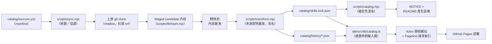

# 系統架構

[**繁體中文**](../zh-TW/architecture.md) | [English](../en/architecture.md) | [文件首頁](README.md)

本頁是一份跨檔案的參考，說明這個 registry 的各個元件如何組合在一起。每個階段
都連結到深入說明它的頁面。

## 資料流

1. **`catalog/sources.yml`** 宣告每個上游、mapping、orphan、local root、
   override 與連結例外（見 [環境設定](configuration.md)）。
2. **`scripts/sync.mjs`** 讀取 manifest，並依模式進行規劃，或把真正的
   apply／baseline 委派給 **`scripts/lib/baseline.mjs`**；後者負責 apply lock、
   journal、candidate／backup swap 與復原（見
   [同步與發布](sync-and-releases.md)）。
3. 宣告的上游會在其釘選的 branch／tag 上進行 **shallow clone** — 絕不使用純
   commit SHA — 而 mapped 來源會在每一條程式路徑上都以相同的排除與符號連結
   規則，staging 到暫存工作區。
4. **`scripts/transform.mjs`** 會把上游來源證明（以及任何
   `rename-frontmatter-name` override）蓋章到 staged 的 `SKILL.md` 上，且永遠
   在內容已經雜湊**之後**才進行，因此記錄下來的 `contentHash` 反映的是真正的
   上游內容，而不是本機蓋章之後的內容。
5. 結果會寫入 **`catalog/skills.lock.json`**（每個 skill 的目前狀態）與
   **`catalog/history/*.json`**（每個 skill 一份帳本，記錄它曾經發生過的每一
   次版本調整）。
6. **`scripts/catalog.mjs`** 會依 lockfile 確定性地渲染 **`NOTICE`**，以及根目錄
   `README.md` 中的
   `<!-- CATALOG:START -->`／`<!-- INSTALL:START -->` 區塊 — 絕不手動編輯
   （見 [技能管理](skill-management.md#為什麼產生的輸出不能被獨立編輯)）。
7. 在建置時期，**`site/src/lib/catalog.ts`** 會為所有 catalog route 讀取
   lockfile，並在個別 skill 詳情頁讀取該 skill 的 history timeline（見
   [網站](website.md)）。
8. 建置完成的網站（包含其 Pagefind 搜尋索引）會部署到 **GitHub Pages**。

`node scripts/validate.mjs` 橫跨每一個階段：它會獨立於任何一次同步執行，走遍
整個 `skills/` 樹，檢查 frontmatter、manifest 涵蓋範圍與相對連結，而
兩個 apply 引擎都會在 candidate swap 後執行它，失敗時回溯。Workflow 另外執行
一次套用前驗證（baseline 也有明確的套用後驗證）。

## 安全邊界

- **受保護的 root。** 不論 manifest 宣告什麼，同步機制永遠不能寫入
  `skills/lettucebo` — 這項保護獨立於 `local:` 區塊強制執行，因此單靠編輯
  manifest 無法解除這項保護。
- **路徑穿越與碰撞防護。** 如果 manifest 路徑解碼後含有 `..` 區段，就會被
  拒絕；兩個 mapping 也絕不能解析到相同或巢狀的目的地 — 這兩項檢查都會在任何
  clone 或寫入之前執行。
- **刪除防護機制。** 宣告 mapping 少於 10 個的群組會擋下任何移除；較大的群組
  會擋下超過 30% 的移除。無法取得的上游也會直接擋下，絕不被解讀為刪除（見
  [技能管理](skill-management.md#刪除防護機制)）。
- **交易、回溯與當機復原。** 每一次真正的寫入都會經過 apply lock、
  candidate／backup 替換，以及一份持久化日誌。套用後驗證失敗會立即回溯；替換
  途中的當機則會在安全清除 stale lock 後，於下一次 apply 依 journal 解決，或
  留下一份清楚回報、可供人工復原的備份（見
  [同步與發布](sync-and-releases.md#交易安全性日誌回溯與當機復原)）。

## 受限制內容隔離

每一個在 lockfile 中被標記為 `"redistributable": false` 的 skill，都會在**網站
資料層**被隔離：`loadSkillBody` 完全拒絕讀取其 `SKILL.md`。詳情頁仍會顯示名稱、
版本、狀態、授權、可取得的上游來源證明與 history，但不顯示 description、操作
說明或單一 skill 安裝指令。只要來源集合含受限制內容，來源層級指令也會被抑制。

完整 registry 指令是刻意保留的例外：catalog 會顯示它，並警告選取完整清單會包含
受限制 skill。Vendored 位元組也仍存在於有 tag 的 repository tree，因此這項邊界
是網站渲染與指令抑制，不是從 Git 移除內容。目前清單可在 `/status/` 查看，或在
lockfile 搜尋 `"redistributable": false`；本文件不會枚舉。

## 延伸閱讀

- [環境設定](configuration.md)、[技能管理](skill-management.md)、
  [同步與發布](sync-and-releases.md) 與 [網站](website.md) — 這份總覽所連結
  到的詳細頁面。
